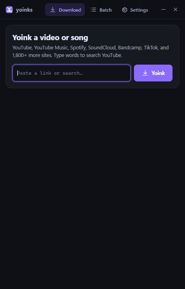
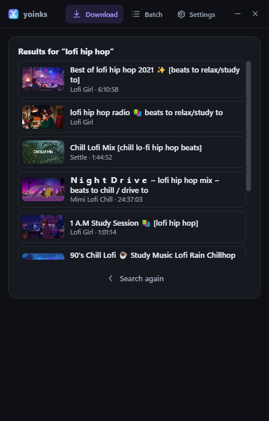
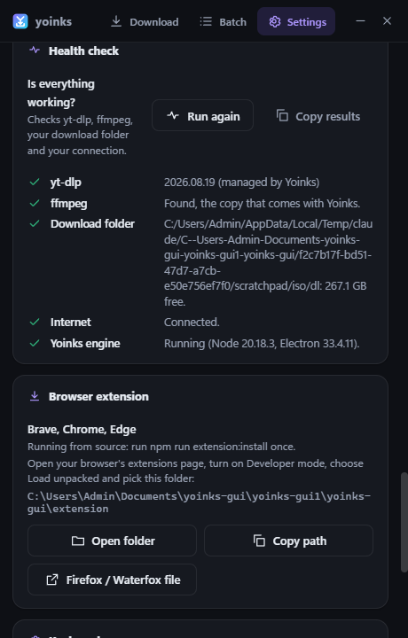
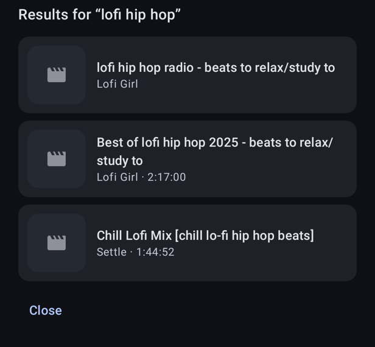
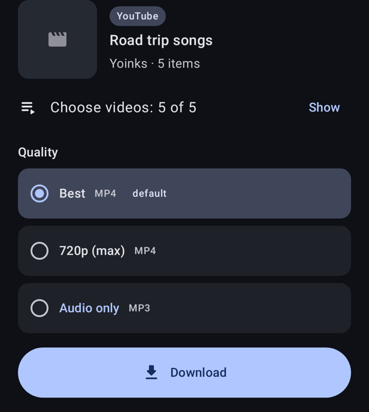

# Yoinks

Save videos and music to your PC from YouTube, YouTube Music, SoundCloud,
Bandcamp, TikTok, Instagram, X, Vimeo, Twitch and 1,800+ other sites — plus
Spotify links, which are matched on YouTube Music. Comes as a **desktop app**
and a **browser extension** (Brave, Chrome, Edge) that share one engine, one
settings file and one UI, plus a native **Android app** (`android/`).

Built on [yoinks](https://github.com/pablostanley/yoinks), with
[yt-dlp](https://github.com/yt-dlp/yt-dlp) doing the downloading and
[ffmpeg](https://ffmpeg.org) the converting. No ads, no tracking, no accounts.

[](https://discord.gg/yEF99JeG9b)
[](https://github.com/bliper2/yoinks-gui-fork/releases/latest)

**Need help, found a bug or have an idea?** Join the [Yoink Community on Discord](https://discord.gg/yEF99JeG9b), or open an [issue](https://github.com/bliper2/yoinks-gui-fork/issues). Common problems and their fixes are in [docs/KNOWN-ISSUES.md](docs/KNOWN-ISSUES.md).

<p align="center"></p>

## Downloads

Everything is on the [Releases](../../releases) page:

| File | What it is |
|---|---|
| `Yoinks-<version>-x64-setup.exe` | Windows installer. Updates itself and sets up the browser helper. |
| `Yoinks-<version>-x64-portable.exe` | Windows, no install: just run it. |
| `Yoinks-<version>-linux-x86_64.AppImage` | Linux, no install: `chmod +x` it and run it. Updates itself. |
| `Yoinks-<version>-linux-amd64.deb` / `-linux-x86_64.rpm` | Linux, Debian/Ubuntu and Fedora/openSUSE packages. |
| `Yoinks-extension-<version>.zip` | Browser extension for Brave, Chrome and Edge, with its helper (see [Browser extension](#browser-extension)). |
| `Yoinks-extension-<version>.xpi` | Browser extension for Firefox 140+ and Waterfox. |
| `Yoinks-android-<version>-arm64-v8a.apk` | Android, almost all phones from the last 8 years. |
| `Yoinks-android-<version>-armeabi-v7a.apk` | Android, old 32-bit phones. |
| `Yoinks-android-<version>-universal.apk` | Android, if unsure which one you need. |

The Windows builds are not code-signed yet, so SmartScreen may warn on first
run (**More info**, then **Run anyway**). The Android APKs are sideloaded: see
[android/README.md](android/README.md#install-on-a-phone). What changed in each
version is in [CHANGELOG.md](CHANGELOG.md), and the apps show it after an update.

## Screenshots

**Desktop app** (the extension's popup is the same UI)

<p>





</p>

**Styles** — Settings → Look → Style: Clean (default), Playful, Neon or Classic, each in light and dark

<p></p>

**Floating navigation** — Settings → Look → Navigation buttons → Floating bottom (Android: Floating navigation bar)

<p>


</p>

**Browser extension** — Yoink buttons on the page

<p>


</p>

**Android**

<p>






</p>

(Android screenshots are rendered from sample data with `gradlew testDebugUnitTest --tests com.yoinks.app.ScreenshotTest`.)

## Updates

- **Windows, installed:** checks this repo's latest release at start and every
  6 hours, downloads a newer version in the background and asks to restart
  (or installs when you close Yoinks).
- **Windows, portable:** cannot replace itself, so it downloads the new
  portable file next to the running one (after checking its size and checksum)
  and tells you. Unpin the old one from the taskbar and pin the new one.
- **Android:** checks at start and offers **Update**; it downloads the APK for
  your phone and opens Android's installer (allow "Install unknown apps" for
  Yoinks the first time).
- **Extension:** unpacked extensions do not update themselves; download the new
  zip (or `.xpi`) and click reload on the extension card.
- yt-dlp updates itself separately (weekly, Settings, yt-dlp), and once more
  right away when a site stops working with the version you have.
- After any update the app shows **What's new** once.

### Publishing a new version

The version is the same everywhere. For `2.3.0`:

1. Set it in `package.json` (`npm pkg set version=2.3.0`), in
   `extension/manifest.json`, and as `versionName` (and a bigger `versionCode`)
   in `android/app/build.gradle.kts`.
2. Add a `## 2.3.0` section to [CHANGELOG.md](CHANGELOG.md) (short enough for one Discord
   message) and run `npm run sync` so the apps show it. `npm test` fails if the
   versions or the copies disagree.
3. Tag and push: `git tag v2.3.0 && git push origin v2.3.0`. The **Release**
   workflow builds the Windows installer, the portable exe and both extension
   downloads, attaches them to a GitHub release, and posts the changelog to
   Discord when the `DISCORD_WEBHOOK_URL` secret is set.
4. Android APKs: the workflow builds signed ones when the keystore secrets are
   set (see the comments in [.github/workflows/release.yml](.github/workflows/release.yml)).
   Otherwise build them yourself (`gradlew assembleDebug` in `android/`), rename
   them `Yoinks-android-2.3.0-arm64-v8a.apk`, `…-armeabi-v7a.apk` and
   `…-universal.apk` (the Android updater looks for these names) and add them
   to the release.

Android installs an update only when it is signed with the same key as the
installed app, so keep the signing key: debug builds use
`%USERPROFILE%\.android\debug.keystore` (back it up), or switch to a release
key, see [android/README.md](android/README.md#signed-release-apk).

## Requirements (to run from source)

- Windows 11 (10 works too)
- [Node.js](https://nodejs.org) 18 or newer, on `PATH`

## Desktop app

```
npm install
npm start
```

If `npm start` says Electron failed to install, run `node node_modules\electron\install.js`
(or use `start.bat`, which does this for you).

First launch shows the Terms once, then downloads a standalone `yt-dlp.exe` to
`%USERPROFILE%\.yoinks\bin`. That copy updates itself weekly (Settings → yt-dlp;
there is also an **Update now** button). A yt-dlp you installed yourself is
left alone.

Build an installer with `npm run dist:win`: `release/Yoinks-<version>-x64-setup.exe`
(installer) and `…-portable.exe`. Builds are unsigned (no code-signing step, so
no admin rights or Developer Mode needed); Windows SmartScreen may warn on
first run. ffmpeg ships next to the app in `resources/`.

`ffmpeg.exe` and `ffprobe.exe` (about 100 MB each) are not in git. To build
the installer, put them in the project root first — take them from the
installed app's `resources/` folder or from [ffmpeg.org](https://ffmpeg.org/download.html).
`npm start` does not need them: it falls back to a system ffmpeg or the
`ffmpeg-static` package.

### Linux

`npm install` and `npm start` work the same. yt-dlp is downloaded to `~/.yoinks/bin`,
settings live in `~/.config/yoinks-gui`, and ffmpeg is the bundled copy, then
the one on your PATH. Build the packages with `npm run dist:linux` (AppImage,
.deb and .rpm in `release/`; put a Linux `ffmpeg` and `ffprobe` in the project
root first, and install `rpm` for the .rpm). The AppImage updates itself; the
.deb and .rpm tell you when a new version is out. The browser helper is set up
by the installed app for every browser it finds; Snap and Flatpak browsers
cannot use it (see `docs/KNOWN-ISSUES.md`).

## Browser extension

Browsers cannot run yt-dlp, so the extension talks to a small helper (`host/host.js`,
a [native messaging](https://developer.chrome.com/docs/extensions/develop/concepts/native-messaging)
host) that runs the same engine as the desktop app. The browser starts it when
needed; the desktop app does not have to be open.

**With the installed Windows app (no Node.js needed):**

1. Install and start Yoinks once. It sets up the helper for Chrome, Edge, Brave,
   Firefox and Waterfox on its own.
2. Open Settings, **Browser extension**: it shows the extension folder and has
   **Open folder** and **Copy path** buttons.
3. Open `brave://extensions` (or `chrome://extensions`, `edge://extensions`), turn
   on **Developer mode**, click **Load unpacked** and pick that folder. Its ID is
   fixed (`ijjoaplmmifaojgihjaefpbobfgfdimp`); the helper only answers that ID.
4. Restart the browser once. A Terms page opens on first install: accept it.

**With the portable app, or from source (Node.js 18 or newer):**

1. Register the helper (per-user registry keys, no admin rights):

   ```
   npm run extension:install
   ```

2. Load the `extension/` folder as in steps 3 and 4 above.

Updating from an older version: click reload on the extension card. Moved the
project folder? Run `npm run extension:install` again. To remove the helper:
`npm run extension:uninstall` (uninstalling the Windows app removes its own).

The extension zip from Releases contains the same folders: unzip it, run
`npm install`, then follow the steps above inside it.

### Firefox / Waterfox

The same extension works in Firefox 140+ and Waterfox. The installed app and
`npm run extension:install` both set up the helper for them. Then:

- **Waterfox:** open `Yoinks-extension-<version>.xpi` (from Releases) with
  Waterfox, or drag it into a window, and click **Add**. Waterfox accepts
  unsigned add-ons, so it stays installed.
- **Firefox:** release Firefox only installs Mozilla-signed add-ons. Use
  `about:debugging`, This Firefox, **Load Temporary Add-on** and pick
  `extension/manifest.json` (gone after a restart), or Firefox Developer
  Edition / Nightly with `xpinstall.signatures.required` set to `false`.

## Android app

A separate native app (Kotlin, Jetpack Compose) in `android/`: share a link
from TikTok, YouTube, Instagram, Snapchat, Spotify … to Yoinks and it
downloads on the phone (yt-dlp and ffmpeg run on the device). Build and
install instructions: [android/README.md](android/README.md). The Android app
is licensed GPL-3.0 because it bundles youtubedl-android
([android/LICENSE](android/LICENSE)).

## What it does

- **Yoink buttons on the page** — next to Like/Share on YouTube, in the player
  bar on YouTube Music plus **Yoink all** next to Save in Up Next (the whole
  playlist you're playing from; not for endless radio mixes), in SoundCloud's action row on track pages and in its
player bar (quick download of whatever is playing, on any page), in Bandcamp's share row,
  in the side column of every video in TikTok's For You / Following feed (under
  Share), and a floating button on single TikTok videos and on Instagram, X,
  Vimeo, Twitch and Spotify pages.
  The button shows its state (adding, queued, a progress ring, done, error);
  its ▾ menu has best video, 1080p, 720p, MP3, a clip from the current
  position, the whole playlist, and "Choose format…".
- **Popup / app** — paste a link and pick a format, or open the popup on a
  video page and it looks the video up right away. **Alt+Y** opens it.
  Right-click any link for **Yoink link…** or **Yoink link as audio**.
- **Music sites** (YouTube Music, SoundCloud, Bandcamp) default to audio with
  clean tags (no " - Topic") and square cover art.
- **Spotify** — Yoinks never downloads from Spotify and never touches DRM. It
  reads the public title, artist, album and cover of a track, album or
  playlist, finds each song on YouTube Music, and shows every match with a
  confidence score (you can pick another result or skip a song). The
  download gets Spotify's tags and cover. Big playlists: Spotify's public page
  lists about the first 50–100 songs.
- **Search** — type words instead of a link and pick from the YouTube results.
- **Playlists** — tick the videos you want before downloading.
- **Presets** — save a combination such as "Music FLAC" (quality, audio format,
  subtitles, cover art) and pick it with one click in the format list or in Batch.
  The format list can also remember a quality for each website.
- **Convert files** (Windows app) — turn video or audio on your PC into MP3, M4A,
  FLAC, Opus or MP4: drop files on the window or use Batch.
- **Yoink all videos on this page** (extension) — right-click a channel,
  playlist, search or profile page, pick which videos to queue in Batch.
- **Health check** — Settings tests yt-dlp, ffmpeg, your folders, storage and
  connection and says which one is broken. **Copy details** on errors does the
  same for one failed link, ready to paste into Discord or a GitHub issue.
- **Batch** — paste many links (or drop/open a `.txt` file) and queue them all.
- **Queue** — pause, resume, retry, cancel; a set number of downloads at once;
  automatic retries for network errors; notifications when done or failed.
  Optional download window ("only between 01:00 and 07:00") on Windows and Android;
  Android can also wait on low battery or Data Saver.
- **Windows extras** — asks before closing while downloads run, drop a link on
  the window, optionally offers links you copy.
- **Android extras** — "Yoink copied link" Quick Settings tile and "Paste link"
  app shortcut, pictures and a Share button in the finished notification.
- **Clear errors** — "This video is age-restricted…" instead of raw yt-dlp output.
- **Looks** — four styles (Clean, Playful, Neon, Classic), Light, Dark or
  System, five accent presets and a custom color, and the navigation buttons
  at the top or as a floating bar at the bottom; applied instantly and the
  same in the app and the extension (Android has the same styles).

## Settings

One settings page, the same in the app and the extension (extension: the gear
icon, or right-click the icon → Options). Everything is saved to
`%APPDATA%\yoinks-gui\settings.json` through the engine, validated by one
schema, and shared: change the folder in the extension and the app follows.

Download folder · default format + "always use it" · file name template with a
live preview (`{artist} - {title}` …) · audio format (MP3, M4A, FLAC, Opus) and
bitrate · embed tags, cover art, subtitles (+ language) · playlist folder and
numbering · sort into folders by uploader or website · split videos with
chapters · concurrent downloads, speed limit, retries, download window ·
notifications ·
keyboard shortcut · yt-dlp auto-update, **Update now**, version · optional
browser cookies (for age-restricted / members-only videos; read the note on
the page) · clear history, reset, export/import JSON · Terms and Privacy.

## Project layout

```
main/
  main.js          Electron main: window, IPC, controller with in-process backend
  updater.js       app updates from GitHub releases (electron-updater)
  helper.js        sets up the browser helper for the installed app
  ytdlp.js         the engine: find/update yt-dlp, probe, formats, searches,
                   settings -> yt-dlp arguments, downloads and conversions
core/              Node code shared by the desktop app and the browser helper
  session.js       one job or request: probe, download, pause, settings, files
  settings-store.js  reads/writes settings.json (validated)
  spotify.js       Spotify public metadata + YouTube Music matching
  match.js         match confidence scoring
  health.js        the Settings health check
  files.js         show in folder / open file (safety checks) / folder picker
  local-backend.js the desktop app's backend for the controller
host/
  host.js          native messaging wire format around core/session.js
  host.bat         launcher the browser starts
  install.js       registers / unregisters the helper
extension/         the browser extension — and the UI the desktop app shows
  manifest.json
  background.js    wires the controller to Chrome APIs (native helper, badge,
                   notifications, context menu, page buttons)
  app.html         the UI: popup, settings tab and desktop window
  shared/          plain scripts usable by the browser AND Node:
    settings-schema.js  every setting: defaults, validation, labels
    controller.js       queue, lookups, retries, history, commands
    sites.js            supported sites and their special handling
    schedule.js         the download window
    filename-template.js, formats.js, errors.js
  ui/              theme.css (all colors), components.css, app.css,
                   theme.js, dom.js, toast.js, bridge.js, views/*
  content/         button.js (the in-page button), mounts.js (where it goes)
  legal/           terms.md, privacy.md; changelog.md is a copy of CHANGELOG.md
preload.js         the desktop window's bridge to main
android/           the Android app (separate Gradle project, GPL-3.0)
tests/             node:test suites for the shared logic, the engine and the queue
scripts/           changelog sync, extension packaging, Discord announcement
build/             Windows app icon, installer and packaging hooks
docs/              screenshots, logo, known issues, landing page
.github/           CI and release workflows, issue forms
```

`extension/shared` and `extension/ui` live inside `extension/` because a
browser only loads files from the extension folder; the desktop app and the
helper load the same files from there.

No frameworks, no bundler: edit and reload.

## Tests

```
npm test                                   desktop, extension and shared logic
cd android && gradlew testDebugUnitTest    Android (also renders the screenshots)
```

CI runs both on every push. The tests include checks that the version, the
changelog copies and the extension's script list agree everywhere.

## Support

- **Discord:** [Yoink Community](https://discord.gg/yEF99JeG9b) for help, update announcements and ideas.
- **Bugs and feature requests:** [GitHub issues](https://github.com/bliper2/yoinks-gui-fork/issues/new/choose). Tell us the app (Windows, extension or Android), its version and the link that failed; **Copy details** on the error does that for you.
- **Common problems:** [docs/KNOWN-ISSUES.md](docs/KNOWN-ISSUES.md).
- **Security problems:** see [SECURITY.md](SECURITY.md); please report them privately.

## Fair use

This is a personal-archiving tool. Downloading can break a site's terms of
service — only download what you have the right to keep. See
`extension/legal/terms.md`.

## Credits

Built on [pablostanley/yoinks](https://github.com/pablostanley/yoinks) (MIT).
Desktop app and extension: MIT (see [LICENSE](LICENSE)). Android app: GPL-3.0.
Powered by [yt-dlp](https://github.com/yt-dlp/yt-dlp) (Unlicense) and
[FFmpeg](https://ffmpeg.org) (LGPL/GPL).
