# Yoinks

Save videos and music to your PC from YouTube, YouTube Music, SoundCloud,
Bandcamp, TikTok, Instagram, X, Vimeo, Twitch and 1,800+ other sites — plus
Spotify links, which are matched on YouTube Music. Comes as a **desktop app**
and a **browser extension** (Brave, Chrome, Edge) that share one engine, one
settings file and one UI, plus a native **Android app** (`android/`).

Built on [yoinks](https://github.com/pablostanley/yoinks), with
[yt-dlp](https://github.com/yt-dlp/yt-dlp) doing the downloading and
[ffmpeg](https://ffmpeg.org) the converting. No ads, no tracking, no accounts.

[](https://discord.gg/yEF99JeG9b)
[](https://github.com/bliper2/yoinks-gui-fork/releases/latest)

**Need help, found a bug or have an idea?** Join the [Yoink Community on Discord](https://discord.gg/yEF99JeG9b), or open an [issue](https://github.com/bliper2/yoinks-gui-fork/issues).

## Downloads

Everything is on the [Releases](../../releases) page:

| File | What it is |
|---|---|
| `Yoinks-<version>-x64-setup.exe` | Windows installer |
| `Yoinks-<version>-x64-portable.exe` | Windows, no install — just run it |
| `Yoinks-extension-<version>.zip` | Browser extension + its helper (see [Browser extension](#browser-extension)) |
| `Yoinks-android-<version>-arm64-v8a.apk` | Android, almost all phones from the last 8 years |
| `Yoinks-android-<version>-armeabi-v7a.apk` | Android, old 32-bit phones |
| `Yoinks-android-<version>-universal.apk` | Android, if unsure which one you need |

The Windows builds are unsigned, so SmartScreen may warn on first run
(**More info → Run anyway**). The Android APKs are sideloaded — see
[android/README.md](android/README.md#install-on-a-phone).

## Screenshots

**Desktop app** (the extension's popup is the same UI)

<p>
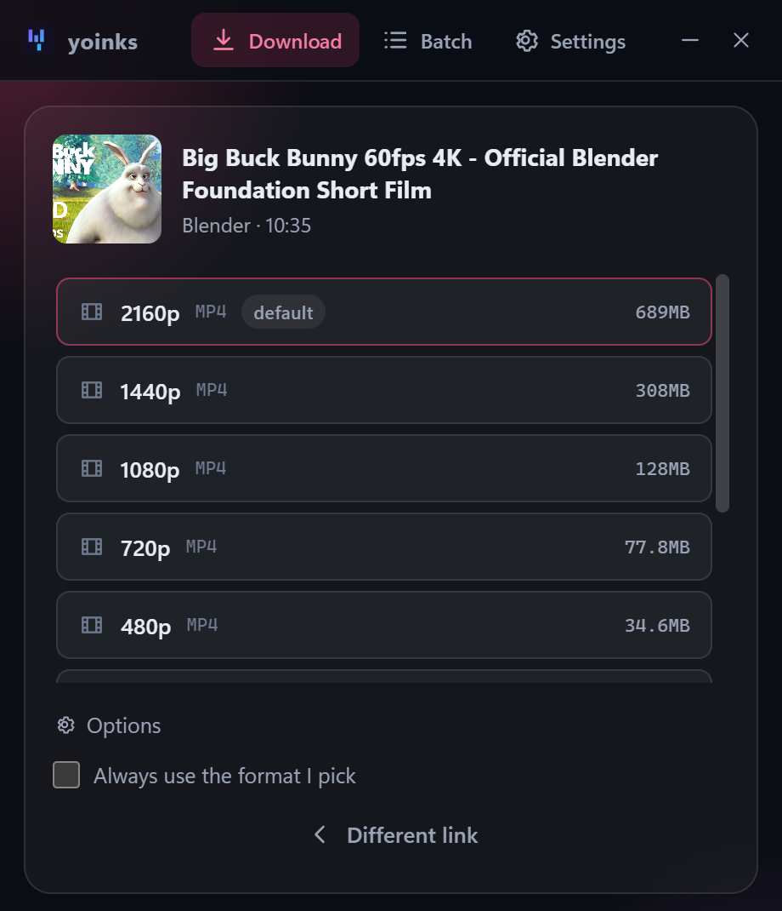
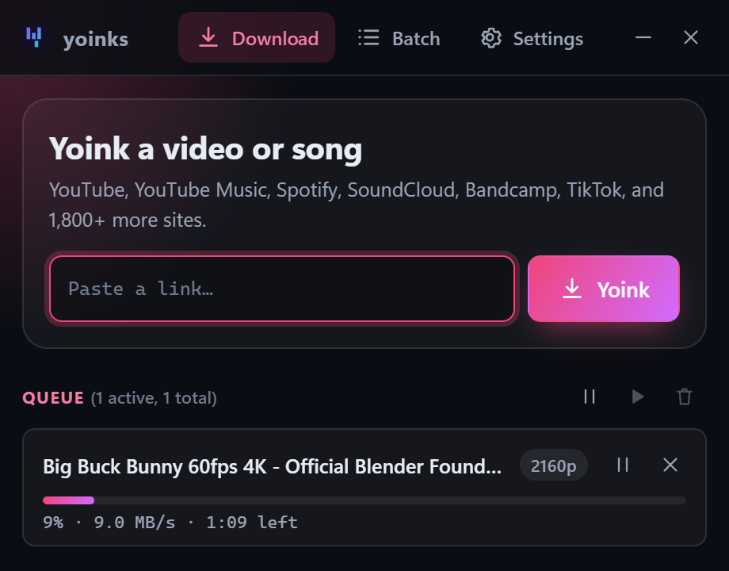
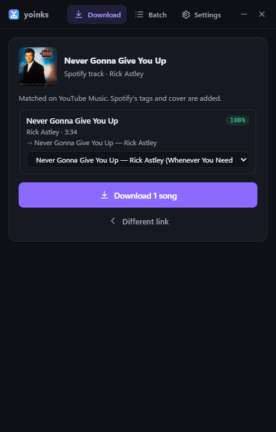
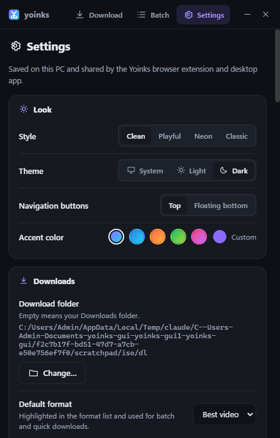
</p>

**Styles** — Settings → Look → Style: Clean (default), Playful, Neon or Classic, each in light and dark

<p>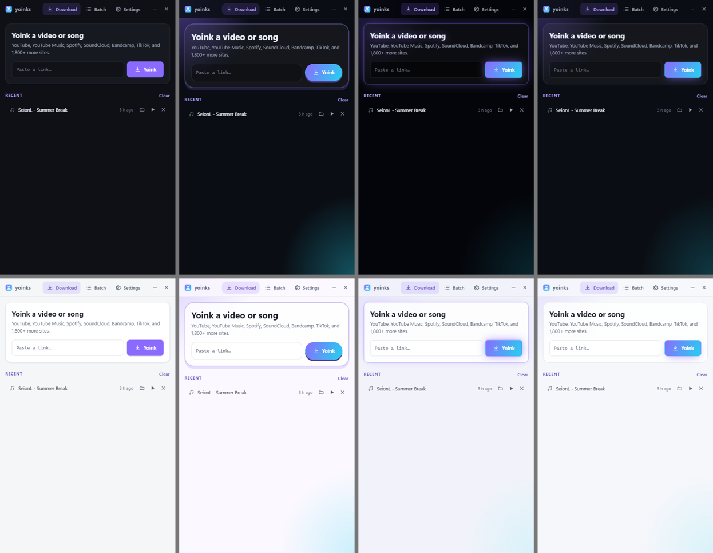</p>

**Floating navigation** — Settings → Look → Navigation buttons → Floating bottom (Android: Floating navigation bar)

<p>
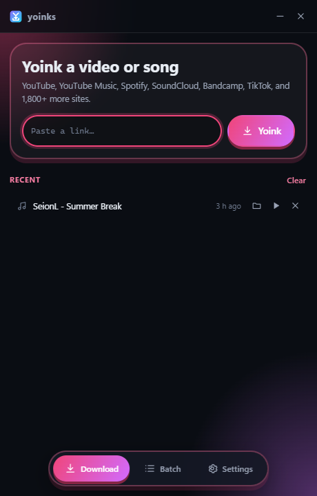
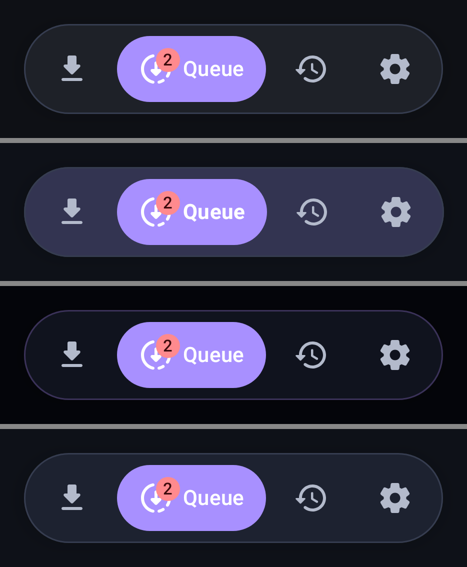
</p>

**Browser extension** — Yoink buttons on the page

<p>
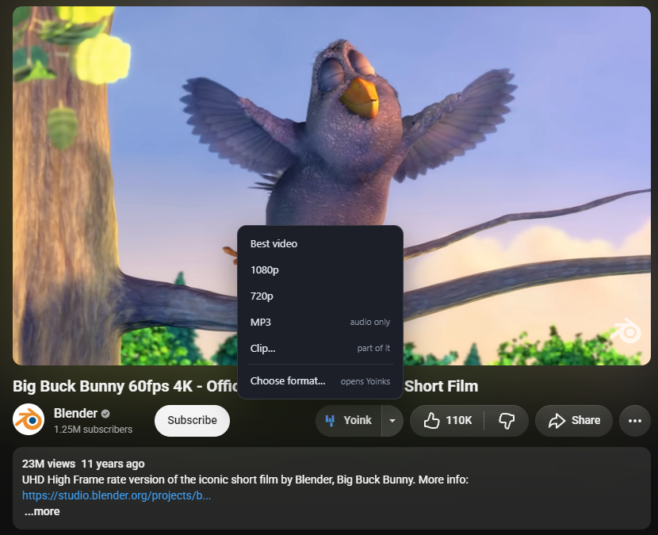
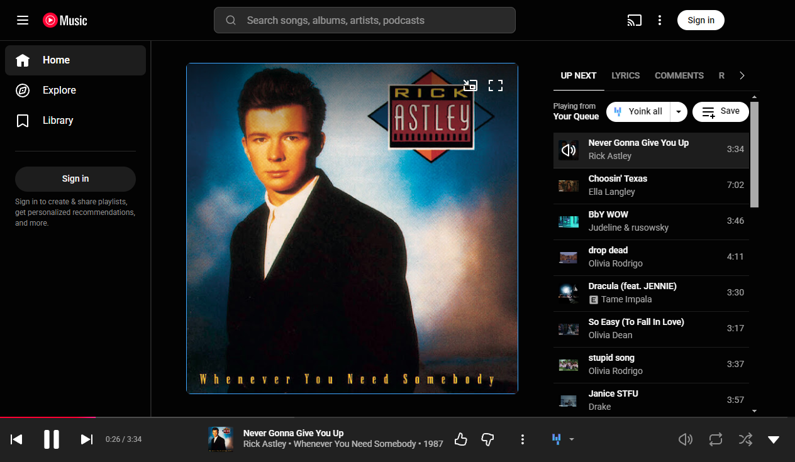
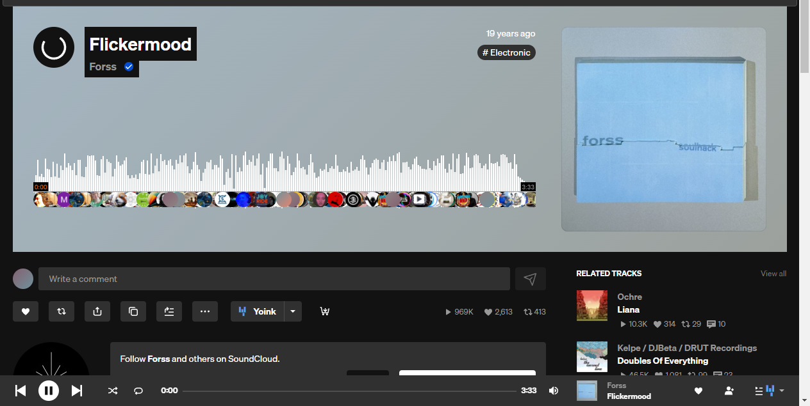
</p>

**Android**

<p>
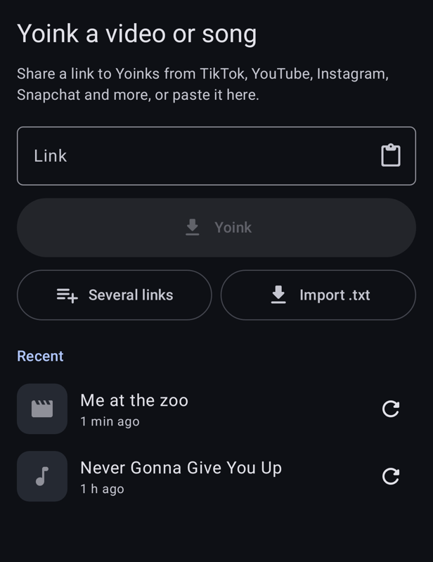
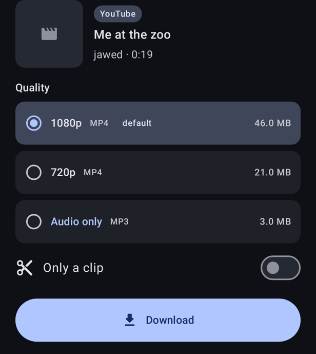
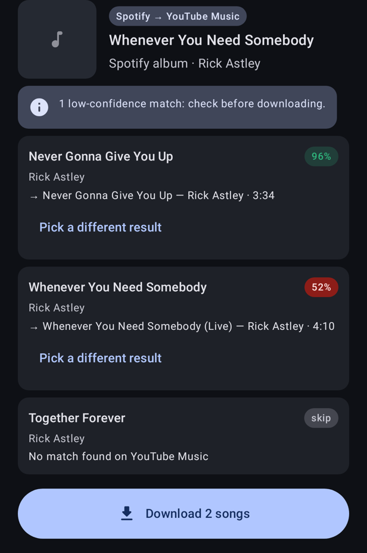
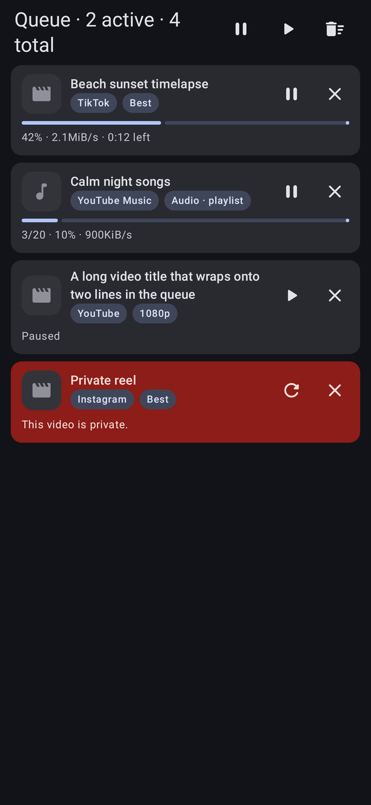
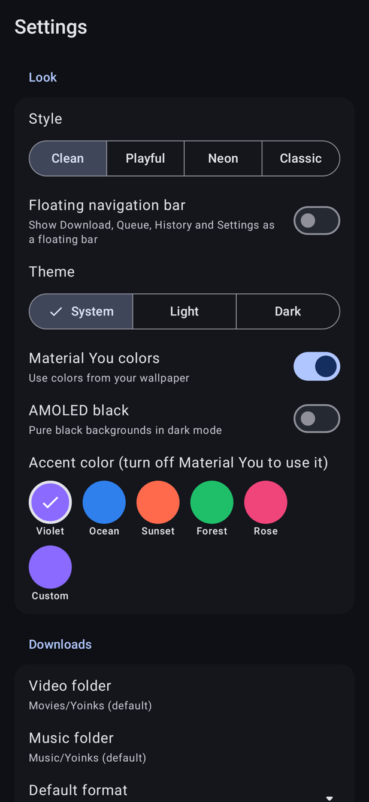
</p>

(Android screenshots are rendered from sample data with `gradlew testDebugUnitTest --tests com.yoinks.app.ScreenshotTest`.)

## Updates

- **Desktop, installed:** checks this repo's latest release at start and every
  6 hours, downloads a newer version in the background and asks to restart
  (or installs when you close Yoinks).
- **Desktop, portable:** can't replace itself; shows a notification that opens
  the Releases page.
- **Android:** checks at start and offers **Update**; it downloads the APK for
  your phone and opens Android's installer (allow "Install unknown apps" for
  Yoinks the first time).
- **Extension:** unpacked extensions don't update themselves; download the new
  zip and click reload ↻ on the extension card.
- yt-dlp updates itself separately (weekly, Settings → yt-dlp).

### Publishing a new version

1. Bump `version` in `package.json` and `versionName` / `versionCode` in
   `android/app/build.gradle.kts` to the same version (e.g. `2.1.0` / `210`).
2. `npm run dist:win` and, in `android/`, `gradlew assembleDebug` (or
   `assembleRelease` with your key).
3. Create a GitHub release tagged `v2.1.0` and upload:
   `release/Yoinks-2.1.0-x64-setup.exe`, `…-setup.exe.blockmap`,
   `release/latest.yml` (the desktop updater reads this), `…-portable.exe`,
   the extension zip, and the APKs renamed to
   `Yoinks-android-2.1.0-arm64-v8a.apk`, `…-armeabi-v7a.apk`, `…-universal.apk`
   (the Android updater looks for these names).

Android installs an update only when it is signed with the same key as the
installed app, so always build updates on the same machine/key (debug builds
use `%USERPROFILE%\.android\debug.keystore`; keep a backup of it, or switch
to a release key — see [android/README.md](android/README.md#signed-release-apk)).

## Requirements (to run from source)

- Windows 11 (10 works too)
- [Node.js](https://nodejs.org) 18 or newer, on `PATH`

## Desktop app

```
npm install
npm start
```

If `npm start` says Electron failed to install, run `node node_modules\electron\install.js`
(or use `start.bat`, which does this for you).

First launch shows the Terms once, then downloads a standalone `yt-dlp.exe` to
`%USERPROFILE%\.yoinks\bin`. That copy updates itself weekly (Settings → yt-dlp;
there is also an **Update now** button). A yt-dlp you installed yourself is
left alone.

Build an installer with `npm run dist:win`: `release/Yoinks-<version>-x64-setup.exe`
(installer) and `…-portable.exe`. Builds are unsigned (no code-signing step, so
no admin rights or Developer Mode needed); Windows SmartScreen may warn on
first run. ffmpeg ships next to the app in `resources/`.

`ffmpeg.exe` and `ffprobe.exe` (about 100 MB each) are not in git. To build
the installer, put them in the project root first — take them from the
installed app's `resources/` folder or from [ffmpeg.org](https://ffmpeg.org/download.html).
`npm start` does not need them: it falls back to a system ffmpeg or the
`ffmpeg-static` package.

## Browser extension

Browsers can't run yt-dlp, so the extension talks to a small helper program
(`host/host.js`, a [native messaging](https://developer.chrome.com/docs/extensions/develop/concepts/native-messaging)
host) that runs the same engine as the desktop app. The browser starts it when
needed; the desktop app doesn't have to be open.

One-time setup:

1. Register the helper (per-user registry keys for Chrome, Edge and Brave, no admin):

   ```
   npm run extension:install
   ```

2. Open `brave://extensions` (or `chrome://extensions`, `edge://extensions`),
   turn on **Developer mode**, click **Load unpacked** and pick the
   `extension/` folder. Its ID is pinned to `ijjoaplmmifaojgihjaefpbobfgfdimp`;
   the helper only accepts that ID.

3. Restart the browser once so it sees the helper. A Terms page opens on first
   install — accept it to start.

Updating from an older version: click reload ↻ on the extension card. The
helper registration doesn't change. Moved the project folder? Run
`npm run extension:install` again. To remove the helper:
`npm run extension:uninstall`.

The extension zip from Releases contains the same folders: unzip it, then run
the steps above inside the unzipped folder (Node.js is still needed for the
helper, and `npm install` first).

### Firefox / Waterfox

The same extension works in Firefox 140+ and Waterfox. `npm run extension:install`
also registers the helper for them. Then:

- **Waterfox:** open `Yoinks-extension-<version>.xpi` (from Releases) with
  Waterfox, or drag it into a window, and click **Add**. Waterfox accepts
  unsigned add-ons, so it stays installed.
- **Firefox:** release Firefox only installs Mozilla-signed add-ons. Use
  `about:debugging` → This Firefox → **Load Temporary Add-on…** and pick
  `extension/manifest.json` (gone after a restart), or Firefox Developer
  Edition / Nightly with `xpinstall.signatures.required` set to `false`.

## Android app

A separate native app (Kotlin, Jetpack Compose) in `android/`: share a link
from TikTok, YouTube, Instagram, Snapchat, Spotify … to Yoinks and it
downloads on the phone (yt-dlp and ffmpeg run on the device). Build and
install instructions: [android/README.md](android/README.md). The Android app
is licensed GPL-3.0 because it bundles youtubedl-android
([android/LICENSE](android/LICENSE)).

## What it does

- **Yoink buttons on the page** — next to Like/Share on YouTube, in the player
  bar on YouTube Music plus **Yoink all** next to Save in Up Next (the whole
  playlist you're playing from; not for endless radio mixes), in SoundCloud's action row on track pages and in its
player bar (quick download of whatever is playing, on any page), in Bandcamp's share row,
  in the side column of every video in TikTok's For You / Following feed (under
  Share), and a floating button on single TikTok videos and on Instagram, X,
  Vimeo, Twitch and Spotify pages.
  The button shows its state (adding, queued, a progress ring, done, error);
  its ▾ menu has best video, 1080p, 720p, MP3, a clip from the current
  position, the whole playlist, and "Choose format…".
- **Popup / app** — paste a link and pick a format, or open the popup on a
  video page and it looks the video up right away. **Alt+Y** opens it.
  Right-click any link for **Yoink link…** or **Yoink link as audio**.
- **Music sites** (YouTube Music, SoundCloud, Bandcamp) default to audio with
  clean tags (no " - Topic") and square cover art.
- **Spotify** — Yoinks never downloads from Spotify and never touches DRM. It
  reads the public title, artist, album and cover of a track, album or
  playlist, finds each song on YouTube Music, and shows every match with a
  confidence score (you can pick another result or skip a song). The
  download gets Spotify's tags and cover. Big playlists: Spotify's public page
  lists about the first 50–100 songs.
- **Batch** — paste many links (or drop/open a `.txt` file) and queue them all.
- **Queue** — pause, resume, retry, cancel; a set number of downloads at once;
  automatic retries for network errors; notifications when done or failed.
- **Clear errors** — "This video is age-restricted…" instead of raw yt-dlp output.
- **Looks** — four styles (Clean, Playful, Neon, Classic), Light, Dark or
  System, five accent presets and a custom color, and the navigation buttons
  at the top or as a floating bar at the bottom; applied instantly and the
  same in the app and the extension (Android has the same styles).

## Settings

One settings page, the same in the app and the extension (extension: the gear
icon, or right-click the icon → Options). Everything is saved to
`%APPDATA%\yoinks-gui\settings.json` through the engine, validated by one
schema, and shared: change the folder in the extension and the app follows.

Download folder · default format + "always use it" · file name template with a
live preview (`{artist} - {title}` …) · audio format (MP3, M4A, FLAC, Opus) and
bitrate · embed tags, cover art, subtitles (+ language) · playlist folder and
numbering · concurrent downloads, speed limit, retries · notifications ·
keyboard shortcut · yt-dlp auto-update, **Update now**, version · optional
browser cookies (for age-restricted / members-only videos; read the note on
the page) · clear history, reset, export/import JSON · Terms and Privacy.

## Project layout

```
main/
  main.js          Electron main: window, IPC, controller with in-process backend
  updater.js       app updates from GitHub releases (electron-updater)
  ytdlp.js         the engine: find/update yt-dlp, probe, formats, music search,
                   settings -> yt-dlp arguments, downloads with progress/pause
core/              Node code shared by the desktop app and the browser helper
  session.js       one job or request: probe, download, pause, settings, files
  settings-store.js  reads/writes settings.json (validated)
  spotify.js       Spotify public metadata + YouTube Music matching
  match.js         match confidence scoring
  files.js         show in folder / open file (safety checks) / folder picker
  local-backend.js the desktop app's backend for the controller
host/
  host.js          native messaging wire format around core/session.js
  host.bat         launcher the browser starts
  install.js       registers / unregisters the helper
extension/         the browser extension — and the UI the desktop app shows
  manifest.json
  background.js    wires the controller to Chrome APIs (native helper, badge,
                   notifications, context menu, page buttons)
  app.html         the UI: popup, settings tab and desktop window
  shared/          plain scripts usable by the browser AND Node:
    settings-schema.js  every setting: defaults, validation, labels
    controller.js       queue, lookups, retries, history, commands
    sites.js            supported sites and their special handling
    filename-template.js, formats.js, errors.js
  ui/              theme.css (all colors), components.css, app.css,
                   theme.js, dom.js, toast.js, bridge.js, views/*
  content/         button.js (the in-page button), mounts.js (where it goes)
  legal/           terms.md and privacy.md — edit the text here
preload.js         the desktop window's bridge to main
android/           the Android app (separate Gradle project, GPL-3.0)
```

`extension/shared` and `extension/ui` live inside `extension/` because a
browser only loads files from the extension folder; the desktop app and the
helper load the same files from there.

No frameworks, no bundler: edit and reload.

## Support

- **Discord:** [Yoink Community](https://discord.gg/yEF99JeG9b) for help, update announcements and ideas.
- **Bugs and feature requests:** [GitHub issues](https://github.com/bliper2/yoinks-gui-fork/issues). Tell us the app (Windows, extension or Android), its version and the link that failed.

## Fair use

This is a personal-archiving tool. Downloading can break a site's terms of
service — only download what you have the right to keep. See
`extension/legal/terms.md`.

## Credits

Built on [pablostanley/yoinks](https://github.com/pablostanley/yoinks) (MIT).
Desktop app and extension: MIT (see [LICENSE](LICENSE)). Android app: GPL-3.0.
Powered by [yt-dlp](https://github.com/yt-dlp/yt-dlp) (Unlicense) and
[FFmpeg](https://ffmpeg.org) (LGPL/GPL).
